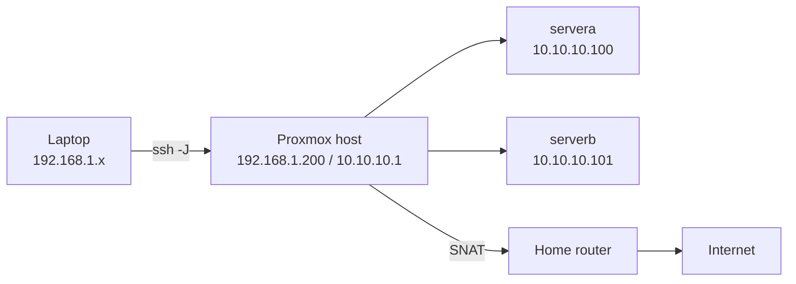

# RHCSA (EX200) on RHEL 10 — Study Journal

My day-by-day journey to the Red Hat Certified System Administrator exam (EX200), based on **Red Hat Enterprise Linux 10**: theory notes in my own words, hands-on labs on a self-built homelab, and revision cheat sheets. Everything is done from the command line.

## Goal

Pass EX200 on RHEL 10. The exam is hands-on: real tasks on live systems, no internet, and **every configuration must survive a reboot**.

## Repo layout

| Folder | What's in it |
|---|---|
| [`lab/`](lab/) | How my lab is built — rebuild it from scratch with this |
| [`notes/`](notes/) | Theory, one file per objective, written after I finish it |
| [`logs/`](logs/) | What I did each study day: commands, mistakes, fixes |
| [`cheatsheets/`](cheatsheets/) | One-page command summaries for exam revision |
| [`templates/`](templates/) | Templates for new notes and logs |

## Lab at a glance

| Component | Details |
|---|---|
| Hypervisor | Proxmox VE 9.2 on a mini PC (64 GB RAM, 512 GB NVMe) |
| Lab network | Isolated SDN network `rhcsanet`, `10.10.10.0/24`, NAT to the internet |
| servera | RHEL 10.2, 2 vCPU, 4 GB RAM, 40 GB OS disk + 2 × 10 GB spare disks |
| serverb | RHEL 10.2, 2 vCPU, 4 GB RAM, 40 GB OS disk + 1 × 10 GB spare disk |
| Access | SSH from my laptop via the Proxmox host as a jump host |

Full build steps: [lab/lab-setup.md](lab/lab-setup.md)

## Progress

| Day | Date | Topic | Log | Notes |
|---|---|---|---|---|
| 1 | 2026-10-02 | Lab build: isolated network, two RHEL 10 VMs, snapshots | [day-01](logs/day-01.md) | — |
| 2 | 2026-10-03 | Obj 1: shell prompt and command syntax (`ls`, `pwd`, `cd`, `man` search) | [day-02](logs/day-02.md) | [01](notes/01-shell-syntax.md) |

## Objectives (RHEL 10 EX200, my study order)

Source: Red Hat's official EX200 page (checked 2026-10-01). Podman/containers are **not** on the RHEL 10 objectives; Flatpak and systemd timers are new.

- [ ] **Phase 1 — Essential tools:** shell syntax, documentation (man, info, /usr/share/doc), files and directories, editing text files, links, redirection, grep and regex, tar/gzip/bzip2, ugo/rwx permissions, switching users, SSH
- [ ] **Phase 2 — Users and access:** users, passwords and aging, groups, sudo, umask, permission troubleshooting
- [ ] **Phase 3 — Software:** RPM repositories, installing and updating packages, Flatpak repositories and packages
- [ ] **Phase 4 — Running systems:** boot/reboot/shutdown, targets, processes and scheduling, tuning profiles, logs and journals, services, secure file transfer
- [ ] **Phase 5 — Shell scripts:** conditionals, loops, script inputs, command output
- [ ] **Phase 6 — Scheduling and time:** at, cron, systemd timers, chrony
- [ ] **Phase 7 — Networking:** IPv4/IPv6, hostname resolution, firewalld, SSH keys
- [ ] **Phase 8 — Local storage:** GPT partitions, LVM, VFAT/ext4/XFS, mounting by UUID/label, swap, extending LVs
- [ ] **Phase 9 — Network storage:** NFS, autofs
- [ ] **Phase 10 — SELinux:** modes, contexts, restorecon, port labels, booleans
- [ ] **Phase 11 — Boot control:** bootloader changes, recovering root access

## Daily workflow

1. Copy `templates/log-template.md` → `logs/day-NN.md` and fill it in.
2. When an objective is finished (lab + exam tasks done), copy `templates/notes-template.md` → `notes/NN-topic.md`.
3. Update the Progress table and tick the objective.
4. `git add .` → `git commit -m "Day NN: <topic>"` → `git push`

> Notes are my own summaries. No content is copied from copyrighted study materials.
